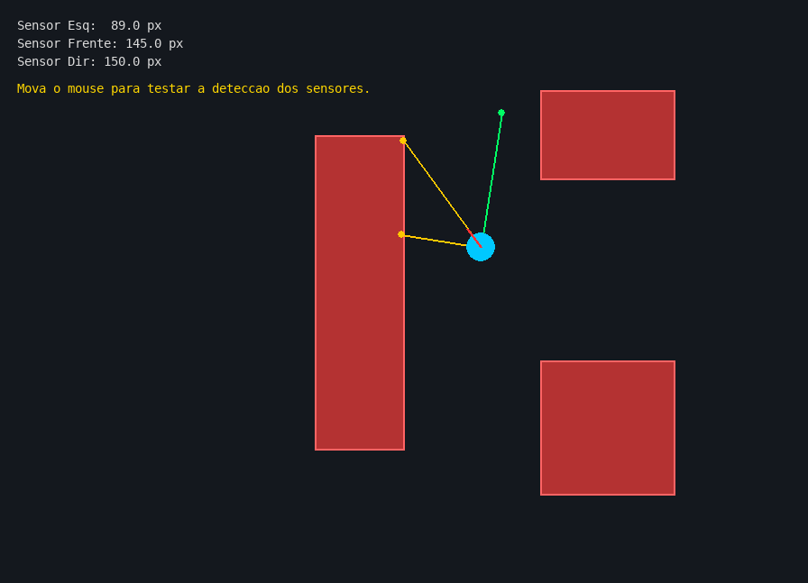
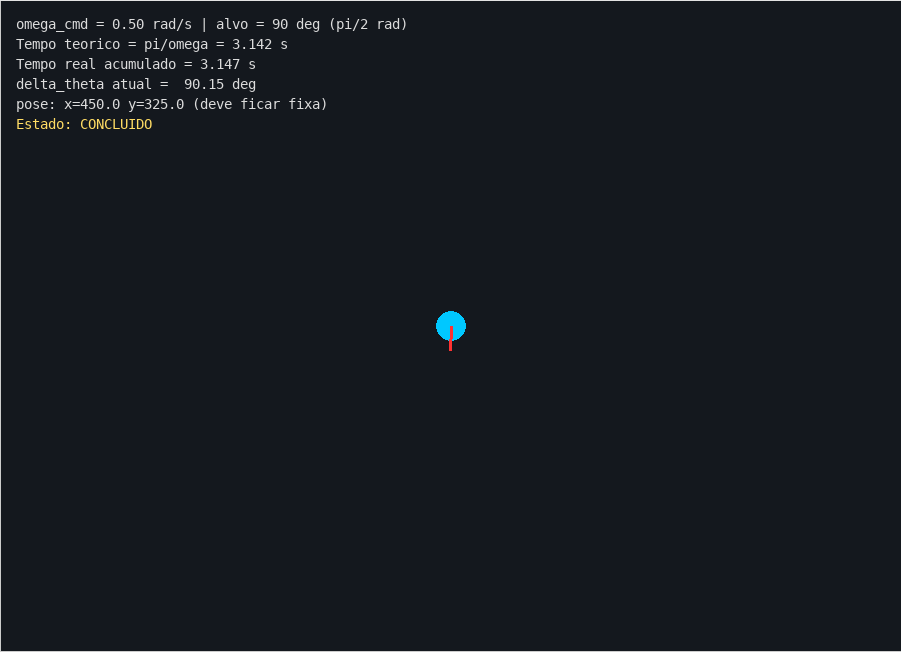
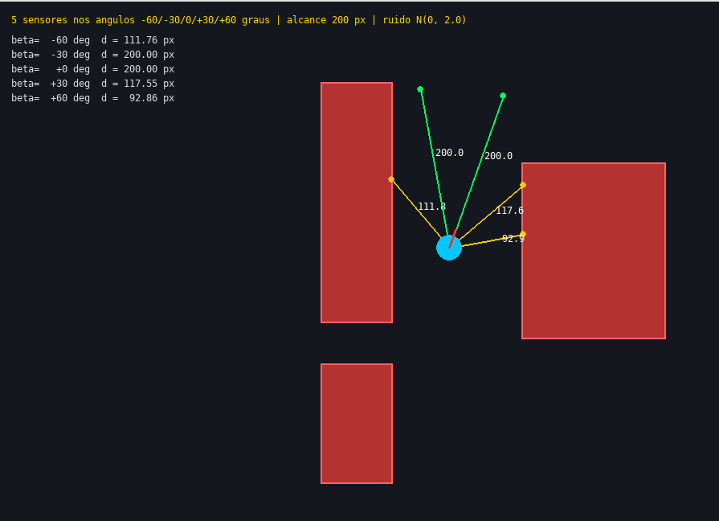
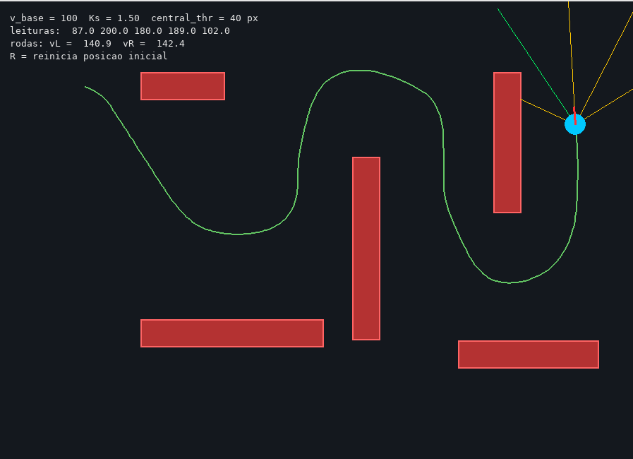
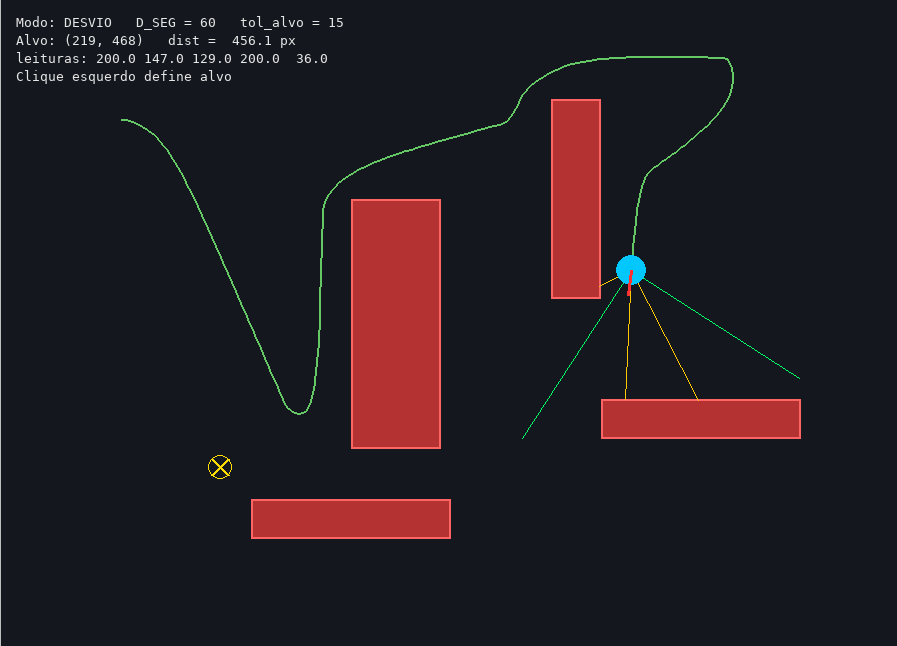

# Resultados Aula 03

Bruno Menezes Gomes / Henrique Ribeiro Siqueira
31/08/26

## Lab 1

Robô com 3 sensores segue o mouse. Feixes ficam amarelos quando batem em obstáculo.

## Lab 2

Robô gira 90° no próprio eixo com ω = 0.5 rad/s. Levou uns 3 segundos.

## Lab 3

5 sensores (-60, -30, 0, +30, +60), alcance 200 px, com ruído. Valores aparecem ao lado dos raios.

## Lab 4

Braitenberg. Robô anda sozinho e desvia dos obstáculos sem alvo nenhum.

## Lab 5

Clico com o mouse e ele vai até o ponto desviando dos obstáculos no caminho.

---

# Relatório

**1. Resultados de cada exercício**

- **Lab 1:** rodei o código do professor e funcionou. Robô segue o mouse e os feixes mudam de cor quando batem em obstáculo.
- **Lab 2:** girou 90° no eixo em uns 3 segundos. Bateu com o cálculo.
- **Lab 3:** coloquei 5 sensores com ruído. Os valores ficam tremendo um pouco mesmo parado, deu pra entender que sensor real não é perfeito.
- **Lab 4:** Braitenberg. O robô anda sozinho e desvia dos obstáculos, achei bem legal de ver.
- **Lab 5:** clica no mouse e ele vai até o ponto desviando dos obstáculos.

**2. Exercício mais difícil**

O Lab 5. Juntar ir até o alvo com desviar dos obstáculos foi complicado. Ficava travando perto de parede e tremendo. Tive que mudar a lógica pra parar de brigar consigo mesmo.

**3. Impressões gerais**

A parte de código é tranquila, mais difícil foi entender que quando o robô erra normalmente não é bug, é a lei de controle mal calibrada. Ficar ajustando os ganhos até dar certo dá trabalho. No geral achei divertido.

