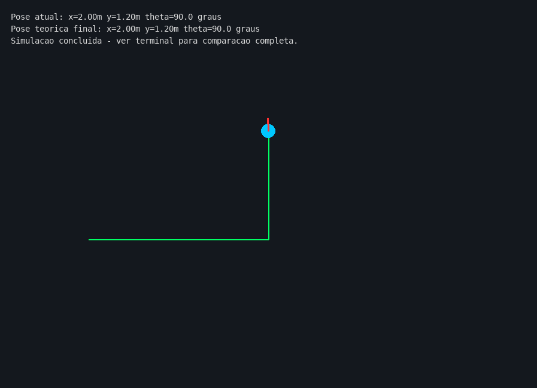
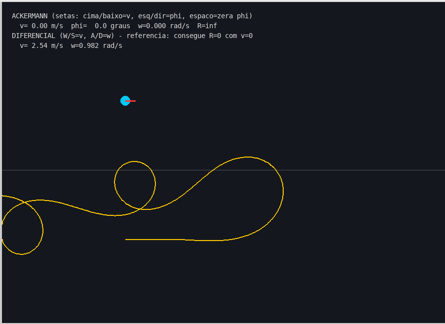
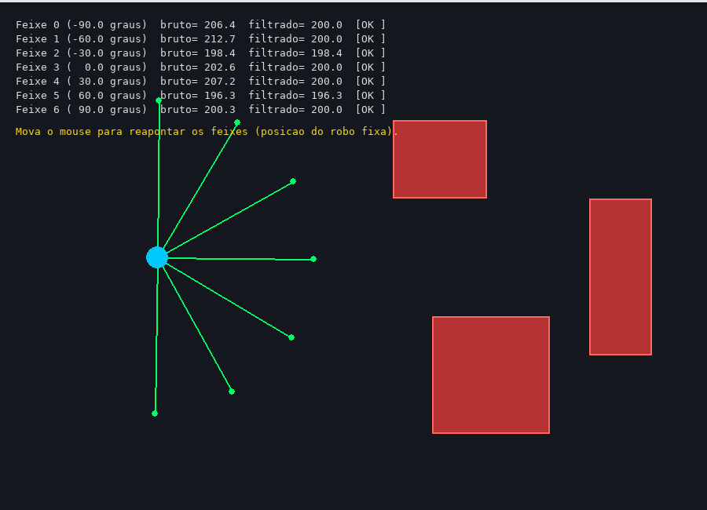
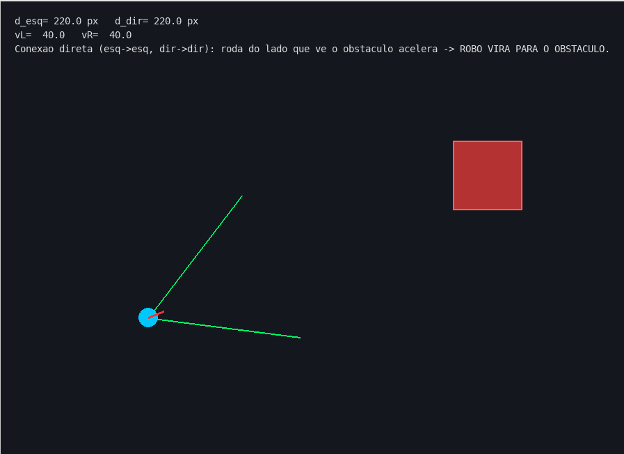
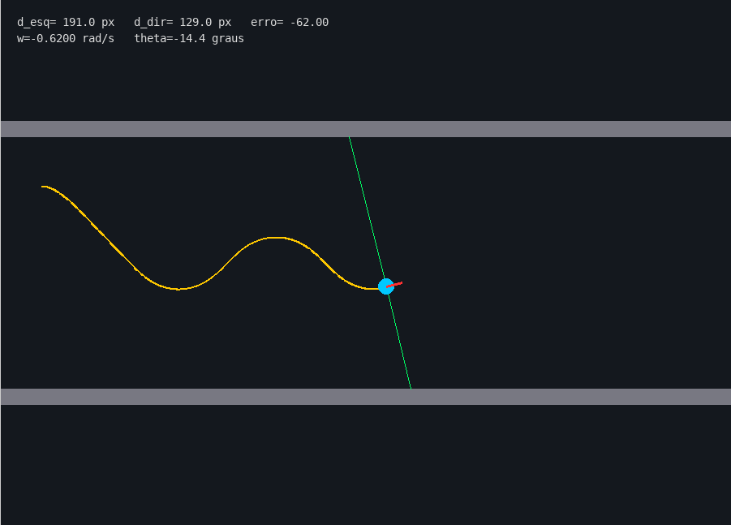

# Resultados Aula 04

Bruno Menezes Gomes / Henrique Ribeiro Siqueira
14/09/26

## Lab 1

Robô roda 3 trechos em malha aberta (reto 4s, gira 90° em 2s, reto de novo 3s) e no final imprime a pose teórica e a simulada.



Saída no terminal:
```
Teorica : x=2.0000 m  y=1.2000 m  theta=90.00 graus
Simulada: x=2.0000 m  y=1.2000 m  theta=90.00 graus
```
Bateu certinho, diferença só na casa decimal de arredondamento.

## Lab 2

Robô Ackermann com entre-eixos de 2m, controlado pelas setas (v e ângulo de esterço φ, travado em ±30°). Do lado tem um diferencial de referência controlado por W/S/A/D. Dá pra ver na tela o R calculado indo pra "inf" quando φ=0 e diminuindo conforme vira mais, mas nunca chega a zero — só o diferencial consegue girar no próprio eixo com v=0.



## Lab 3

7 feixes cobrindo 180° na frente do robô, com ruído gaussiano somado em cada leitura. O filtro descarta leitura abaixo de 10px (marca como erro) e crava em 200px quando passa do alcance. Dá pra ver o valor bruto tremendo (por causa do ruído) e o filtrado ficando bem mais estável ao lado.



## Lab 4

Braitenberg com ligação direta (sensor esquerdo → roda esquerda, direito → roda direita). Diferente da Aula 03, aqui o robô vira PARA o obstáculo em vez de fugir — a roda do lado que vê o obstáculo acelera e puxa o robô na direção dele.



## Exercício 5

Corredor com duas paredes paralelas, robô começa desalinhado (mais perto da parede de cima). Controle proporcional usando a diferença entre os dois feixes laterais corrige o ângulo até o robô ficar centralizado e seguir reto.



---

# Relatório

**1. Resultados de cada exercício**

- **Lab 1:** rodou os 3 trechos e a pose calculada na mão bateu exatamente com a simulada no Pygame (x=2.0, y=1.2, theta=90°). Como cada trecho só tem v ou w (nunca os dois junto), a integração é exata, não teve erro de acúmulo.
- **Lab 2:** deu pra sentir na prática a diferença entre os dois modelos. O Ackermann precisa de espaço pra virar (o R nunca zera), o diferencial vira no lugar. Ficou visual e intuitivo.
- **Lab 3:** com ruído a leitura bruta fica "tremendo" mesmo com o robô parado, igual comentamos na Aula 03. O filtro de limiar resolveu tanto o caso de leitura fantasma (muito perto) quanto o de saturação (muito longe).
- **Lab 4:** engraçado ver o comportamento invertido da Aula 03 — antes o robô fugia do obstáculo, agora com a ligação direta ele vai na direção dele.
- **Exercício 5:** esse deu mais trabalho de acertar o sinal do erro (ver item 2). Depois de corrigido o robô sai torto e converge suave pro centro do corredor.

**2. Exercício mais difícil**

O Exercício 5. A fórmula do roteiro (e = d_esq - d_dir) assume y crescendo pra cima, só que no Pygame o y cresce pra baixo — então o cálculo literal fazia o robô virar PARA a parede mais perto em vez de fugir dela, e ele ficava colado na parede girando sem sentido. Resolvemos invertendo a ordem do erro (e = d_dir - d_esq) pra compensar a convenção de tela, e ainda limitamos o w máximo pra não disparar giro brusco quando a leitura fica maluca perto da parede.

**3. Impressões gerais**

Comparado com a Aula 03, aqui deu mais pra sentir a matemática por trás (cinemática diferencial x Ackermann, filtro de sensor, controle proporcional). O bug do Exercício 5 foi bom aprendizado: erro de sinal em controle de malha fechada não dá erro no código, dá comportamento errado — só olhando o robô se comportar mal que a gente percebeu.
